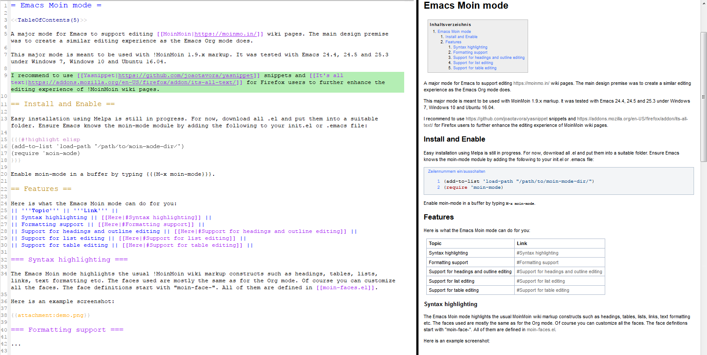

# Emacs Moin mode
A major mode for Emacs to support editing [MoinMoin](https://moinmo.in/) wiki pages. The main design premise was to create a similar editing experience as the Emacs Org mode does.

This major mode is meant to be used with MoinMoin 1.9.x markup. It was tested with Emacs 24.4, 24.5 and 25.3 under Windows 7, Windows 10 and Ubuntu 16.04.

I recommend to use [Yasnippet](https://github.com/joaotavora/yasnippet) snippets and [It's all text](https://addons.mozilla.org/en-US/firefox/addon/its-all-text/) for Firefox users to further enhance the editing experience of MoinMoin wiki pages.

## Install and Enable 

Easy installation using Melpa is still in progress. For now, download all .el and put them into a suitable folder. Ensure Emacs knows the moin-mode module by adding the following to your init.el or .emacs file:
```elisp
(add-to-list 'load-path "/path/to/moin-mode-dir/")
(require 'moin-mode)
```
Enable moin-mode in a buffer by typing `M-x moin-mode`.

## Features

Here is what the Emacs Moin mode can do for you:
  * [Syntax highlighting](#syntax-highlighting)
  * [Formatting support](#formatting)
  * [Support for headings and outline editing](#headings)
  * [Support for list editing](#lists)
  * [Support for table editing](#lables)

### Syntax Highlighting

The Emacs Moin mode highlights the usual MoinMoin wiki markup constructs such as headings, tables, lists, links, text formatting etc. The faces used are mostly the same as for the Org mode. Of course you can customize all the faces. The face definitions start with "moin-face-". All of them are defined in [moin-faces.el](moin-faces.el).

Here is an example screenshot:



You can see all syntax highlighting faces in action in  [syntaxHighlightingTestBuffer.txt](syntaxHighlightingTestBuffer.txt).

### Formatting

The Emacs Moin mode allows you to set the common formattings by using the following key-bindings

  * `C-c C-f C-b` - `moin-command-format-bold` - Insert MoinMoin bold formatting (six ') at point and places point in the middle, or, if mark is active, three ' surrounding the currently selected text
  * `C-c C-f C-i`, `C-c C-f C-e` - `moin-command-format-italic` - Insert MoinMoin italic formatting (four ') at point and places point in the middle, or, if mark is active, two ' surrounding the currently selected text
  * `C-c C-f C-u` - `moin-command-format-underline` - Insert MoinMoin underline formatting (two _) at point and places point in the middle, or, if mark is active, one _ surrounding the currently selected text

### Headings

The Emacs Moin mode is based on Emacs outline-mode, but extra tweaking was necessary to make it work with MoinMoin's enclosing "=" markups, and it adds an outline cycle feature.

**Navigate between headings:** (inherited from outline-mode, but mapped to slightly different keys)
  * `C-c C-x C-n` - `outline-next-visible-heading` - Move to the next visible heading
  * `C-c C-x C-p` - `outline-previous-visible-heading` - Move to the previous visible heading
  * `C-c C-x C-f` - `outline-forward-same-level` - Move fo the next visible heading on the same level
  * `C-c C-x C-b` - `outline-backward-same-level` - Move fo the previous visible heading on the same level
  * `C-c C-x C-u` - `outline-up-heading` - Move to the next higher level heading

**Outline Cycle:** As you might be used to in Org mode, pressing `TAB` if point is on a heading cycles the content belonging to this heading through the following states:
  * `FOLDED`: Hides the entire subtree and content of the current heading
  * `CHILDREN`: Shows the content of the current heading and all direct child headings of the next lower level below the current heading. The child heading subtrees remain hidden.
  * `SUBTREE`: The entire content and subtree below the current heading is shown entirely, no folding.

**Create new headings:**
  * `M-<return>` - `moin-command-meta-return` - If point is outside of a list and outside of a table, this command inserts a new heading on the next line, splitting any content at point. The new heading has the same level as the previous heading, or level 1, if there is no previous heading.
  * `C-<return>` - `moin-command-insert-heading-respect-content` - This inserts a new heading just before the next heading (or end of document, respectively) on the same level as the previous heading or level 1, if there is no previous heading.

**Change the document's outline:**
  * `M-<left>` - `moin-command-meta-left` - If point is currently on a heading line, it promotes the current heading, leaving its children unchanged, but only if the current heading is not already on level 1. This command does not work with an active mark, which will lead to an error being thrown. It also fixes   errors in the end marker of the heading, if necessary.
  * `M-S-<left>` - `moin-command-meta-shift-left` - If point is currently on a heading line, it promotes the current subtree (i.e. the current heading and all its children), if the current heading is not already on level 1. This command does not work with an active region, which will lead to an error being thrown. It also fixes errors in the end marker of the heading, if necessary.
  * `M-<right>` - `moin-command-meta-right` - If point is currently on a heading line, it demotes the current heading, leaving its children unchanged, but only if the current heading is not already on level 5. This command does not work with an active mark, which will lead to an error being thrown. It also fixes errors in the end marker of the heading, if necessary.
  * `M-S-<right>` - `moin-command-meta-shift-right` - If point is currently on a heading line, it demotes the current subtree (i.e. the current heading and all its children), if the current heading is not already on level 5. This command does not work with an active region, which will lead to an error being thrown. It also fixes errors in the end marker of the heading, if necessary.
  * `M-<up>`, `M-S-<up>` - `moin-command-meta-up`, `moin-command-meta-shift-up` - If point is currently on a heading line, it basically does the same thing as `outline-move-subtree-up`: It moves the subtree of the current heading to the point before the previous heading of the same level, if any. If there is no such heading, it throws an error.
  * `M-<down>`, `M-S-<down>` - `moin-command-meta-down`, `moin-command-meta-shift-down` - If point is currently on a heading line, it basically does the same thing as `outline-move-subtree-down`: It moves the subtree of the current heading to the point after the subtree of the next heading of the same level, if any. If there is no such heading, it throws an error.

### Lists

**Create new lists and list items:**
  * `M-<return>` - `moin-command-meta-return` - If point is currently in a list, it inserts a new item with the same level as the one at point. If the command is used in the middle of a list item, it is split and the text after point is taken as text of the new item. The new item is then inserted after  the item at point. If point is currently before the item, the new item is inserted before the current item instead.
  * `C-c C-b` - `moin-command-create-bullet-list` - Create a new bullet-point. If point is at the end of line, it inserts a new line after point and creates a new list on the next line. If point is not at the end of the line, it splits the current line at point and takes the remainder of the current line as content of the first item in the new list. If point is at the beginning of line, it turns the current line into a list item. If currently already in a list, this has a similar effect as using `moin-command-meta-return` to insert a new list item, with two major differences: First, the new item will be inserted as top-level item, and second it will not respect the type of the previous top-level item, but always inserts a bullet-point item. Thus, you should use this command really only to create a new list, and if you are already in a list, use `moin-command-meta-return` instead. 
  * `C-c C-n` - `moin-command-create-numbered-list` - Create a new numbered list. If point is at the end of line, it inserts a new line after point and creates a new list on the next line. If point is not at the end of the line, it splits the current line at point and takes the remainder of the current line as content of the first item in the new list. If point is at the beginning of line, it turns the current line into a list item. If currently already in a list, this has a similar effect as using `moin-command-meta-return` to insert a new list item, with two major differences: First, the new item will be inserted as top-level item, and second it will not respect the type of the previous top-level item, but always inserts a numbered item. Thus, you should use this command really only to create a new list, and if you are already in a list, use `moin-command-meta-return` instead.

**Reorganizing lists:**
  * `M-<left>` - `moin-command-meta-left` - If point is currently in a list, it decreases the indentation by just removing one blank, leaving its children unchanged. A single item's indentation can only be decreased if it is not already on the left-most indentation level of the list. Furthermore, if the item has children, its indentation cannot be decreased. Use `moin-command-meta-shift-left` in this case instead. If the item spans over multiple lines, one blank is removed from each line of the item, unless there is just a single blank left which is always kept. Point is kept before the current character, except when point is at start of line, in which case it remains there.
  * `M-S-<left>` - `moin-command-meta-shift-left` - If point is currently in a list, it decreases the indentation of the current item with its subtree (i.e. all its children) by just removing one blank. A subtree's indentation can only be decreased if it is not already on the left-most indentation level of the list. If any item in the current subtree spans over multiple lines, one blank is removed from each line, unless there is just a single blank left which is always kept. Point is kept before the current character, however, if point is at start of line, it remains there.
  * `M-<right>` - `moin-command-meta-right` - If point is currently in a list, it increases the indentation by just adding one blank, leaving its children unchanged. An item's indentation can only be increased if it is not the first item below its parent. If the item spans over multiple lines, one blank is added at the beginning of each line of the item. Point is usually kept before the current character. However, if point is at start of line, it remains there.
  * `M-S-<right>` - `moin-command-meta-shift-right` - If point is currently in a list, it increases the indentation of the current item with its subtree (i.e. all its children) by just adding one blank. An item's indentation can only be increased if it is not the first item below its parent. If any item in the current subtree item spans over multiple lines, one blank is added at the beginning of each line. Point is usually kept before the current character. However, if point is at start of line, it remaind there.
  * `M-<up>`, `M-S-<up>` - `moin-command-meta-up`, `moin-command-meta-shift-up` - If point is currently in a list, it moves the current item with its subtree up (swapping with previous item), if it is not already the first item below its parent item.
  * `M-<down>`, `M-S-<down>` - `moin-command-meta-down`, `moin-command-meta-shift-down` - If point is currently in a list, it moves the current item with its subtree down (swapping with next item), if it is not already the last item below its parent item.

### Tables

**Creating tables:**
  * `C-c |` - `moin-command-create-table` - Creates a new moin-style table with the given number of rows and columns. If point is at beginning of line, the table is created before the current line, and a newline is inserted between table and text. If point is not at the beginning of line, the table is created after the current line, and a newline is inserted between text and table.

**Moving:**
  * `TAB` - `moin-command-tab` - If point is currently in a table, it moves to the next table field to the right, or to the first field of the next row, if the current field is in the last column of the table. If the current field is the last field of the table in the right-most column, this command will create a new empty row and put point into the left-most field of the new row. If the next field already constains text, this command positions point just before the first non-whitespace character of the field. After moving to the next field - for both the current as well as the next field - this command ensures that there is just exactly one blank after the previous and before the next column separator.
  * `S-TAB` - `moin-command-table-previous-field` - When in a table, moves to the previous field, if any. The previous field is the field to the left of the current one, or in case that the current field is in the left-most column, the last field of the previous row. In contrast to `moin-command-tab` in tables, it will not prepend a new row in case point is currently in the very first field of the table. If the previous field already contains text, this command positions point just before the first non-whitespace character of the field. After moving to the previous field - for both the current as well as the previous field - this command ensures that there is just exactly one blank after the previous and before the next column separator.
  
**Duplicating and splitting cells:**
  * `<return>` - `moin-command-return` - When in a table, moves to the next row. If there is no next row, this command creates a new row. For both the current as well as the field below where this command moves to, it ensures that - after moving to the next field - there is just exactly one blank after the previous and before the next column separator. On the end or start of a line, it still does a line break and thus can be used to split a table.
  * `S-<return>` - `moin-command-table-copy-down` - When in a table, moves to the next row and copies the content of the current field down. If the next row already contains text in the -field below, this text is replaced by the copied text. If there is no next row, this command creates a new row. For the current field, it ensures that - after moving to the next field - there is just one blank after the previous and before the next column separator. On the end or start of a line, this command throws an error.
  * `M-<return>` - `moin-command-meta-return` - If point is currently in a table, it moves to the next row, splitting the content of the current field in two parts starting at point, if point is currently in the middle of the field. If there is a next row, and the field in the next row already contains text, this text is prepended by the text split from the current row's field. If there is no next row, this command creates a new row. For the current as well as the target field, it ensures that - after moving to the next field - there is just exactly one blank after the previous and before the next column separator. Issued at the end or start of a line, this command throws an error. In contrast to org mode, selection or prefix arguments are not considered, there is no specific functionality for this.

**Reorganizing table columns:**
  * `M-<left>` - `moin-command-meta-left` - If point is currently in a table, it moves the current column of the table to the left, but only if it is not already the left-most column. After movement, point is set to be at the start of the column directly behind the column delimiter.
  * `M-S-<left>` - `moin-command-meta-shift-left` - If point is currently in a table, it removes the current column of the table. Point is placed at the beginning of the next column, if any. If there is no next column, it is placed at the beginning of the previous column, if any.
  * `M-<right>` - `moin-command-meta-right` - If point is currently in a table, it moves the current column of the table to the right, but only if it is not already the right-most column.
  * `M-S-<right>` - `moin-command-meta-shift-right` - If point is currently in a table, it inserts a new empty column to the left of the current column. Point is placed within the same row and the beginning of the new column.

**Reorganizing table rows:**
  * `M-<up>` - `moin-command-meta-up` - If point is currently in a table, it moves the current row up (swapping with previous row), if it is not already the first row in the table.
  * `M-S-<up>` - `moin-command-meta-shift-up` - If point is currently in a table, it removes the current row of the table.
  * `M-<down>` - `moin-command-meta-down` - If point is currently in a table, it moves the current row down (swapping with next row), if it is not already the last row in the table.
  * `M-S-<down>` - `moin-command-meta-shift-down` - If point is currently in a list, it moves the current item with its subtree down (swapping with next item), if it is not already the last item below its parent item.

## Known Issues

The following issues are currently known, whereas I hope they should only rarely be of bigger annoyance:
  * Syntax highlighting for nested formattings (bold inside underline etc.) will most probably not or not reliably work. If someone knows how to formulate corresponding regex patterns to handle all possible cases (without writing a finder function), your advice would be very welcome :-)
  * Furthermore, formatting syntax highlighting will end at line end. Note that MoinMoin does not interpret a single line break as an actual line break. Using bold formatting crossing such a "fake" newline will not detect the bold text, because it scans for the end delimiter only up to the next line break
  * Trying to move around table columns or rows within tables that have merged cells (i.e. colspans or rowspans) will most probably lead to errors

## Planned Features

The following features sound like worthy additions:
  * Support for colspan and rowspan tables
  * Index of local headings to use for hyperlinking
  * Tackling some other of the known issues

## Bug Reports

Please check first if the issue might already be a [known issue](#kown-issues). Please create a bug in the [GitHub bug tracker](https://github.com/jebbard/emacs-moin-mode/issues).
